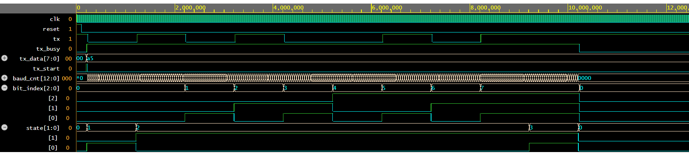

# uart-fsm-verilog
FSM based UART Transmitter implemented in Verilog with full simulation and testbench verification.

## UART TX Verification

The UART transmitter was verified using simulation and waveform analysis.
FSM transitions, data sequencing, baud timing, and stop-bit behavior were validated.

